# Couse2-Alexnet
《机器学习》大作业2

 |                                  |             |                                 |             |                                |             |
 |----------------------------------|-------------|---------------------------------|-------------|--------------------------------|-------------|
 | 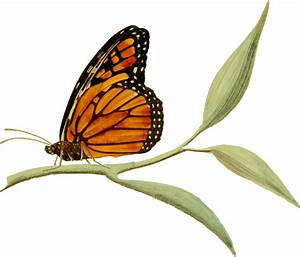 | 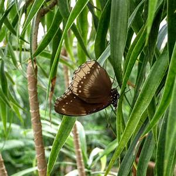 | 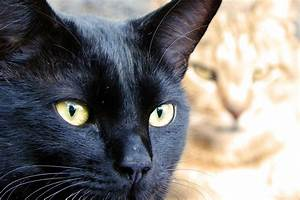 | 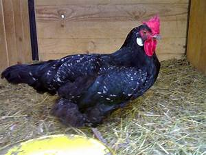 |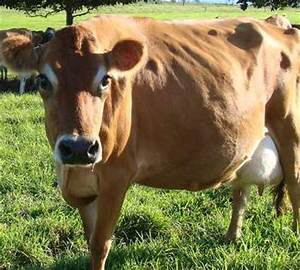 | 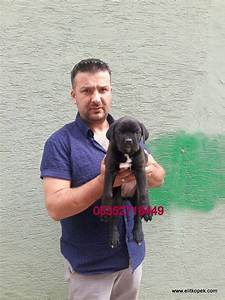 |
 | Butterfly | Butterfly | Cat | Chicken | Cow | Dog |
 | 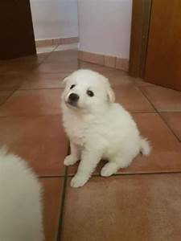 | 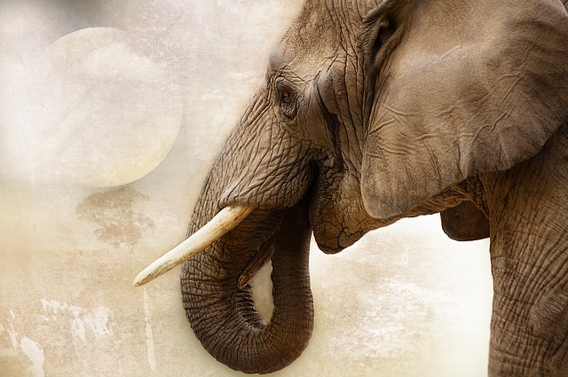 |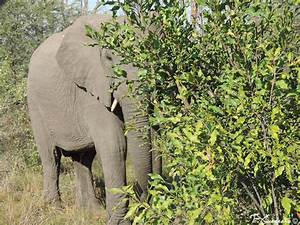 | 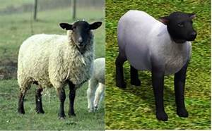 |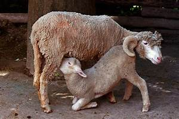 |  |
 | Dog | Elephant | Elephant | Sheep | Sheep | Spider |

## Data
* Download the Animals-10 dataset from https://jbox.sjtu.edu.cn/1/X1L5Rp, password: hwqw.
* Rename the image files to `type_num.jpg`.
* Resize the images to (277,277).
* Merge all the folders to one in order to load dataset conveniently.
* Split one to `train` dataset and `test` dataset.
```bash
python tools/process.py
```

## Train

**Environment:** Python3.8+Pytorch1.11+CUDA11.3

Train using the train dataset generated by last step. The parameters could be specified by yourself. The trained model will be saved to `/pkl` by default.
```bash
python tools/train.py --batch_size 20 --epoch 200
```

## Test
Test the accuracy of trained model using test dataset. The direction of dataset is set by default (absolute path).
```bash
python tools/test.py --test_dir
```
When finishing training, using tensorboard to visulaize the Descending Loss Curve.
```bash
tensorboard --logdir '/path/to/logdir/'
```
An example is shown as below (Training epoch200, batch_size200).
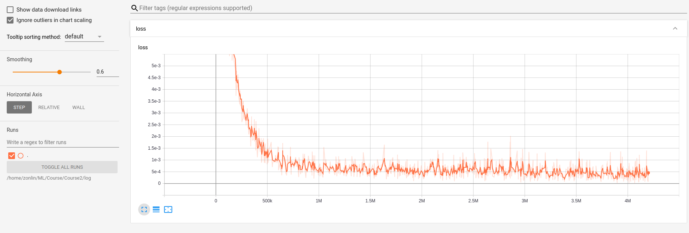

## Predict
Predict an unknown picture (without label which is different from test). You should specify one picture in `img_dir`.
```bash
python tools/pred.py --img_dir
```

## Pretrained Model
Download pretrained model (using GTX1650).

| Parameter | Accuracy | time cost | url |
|-----------|----------|-----------|-----|
|epoch20, batch_size200 | 0.61 | 2h |https://drive.google.com/file/d/1gcNLOjU0FoYaiYHkq80AAbRM2qsqEyE2/view?usp=sharing|
|epoch200, batch_size200 | 0.65 | 4.7h |https://drive.google.com/file/d/1Z0SZWIFeOOn5VBO6iUN-dYsJfSzBEw1m/view?usp=sharing|